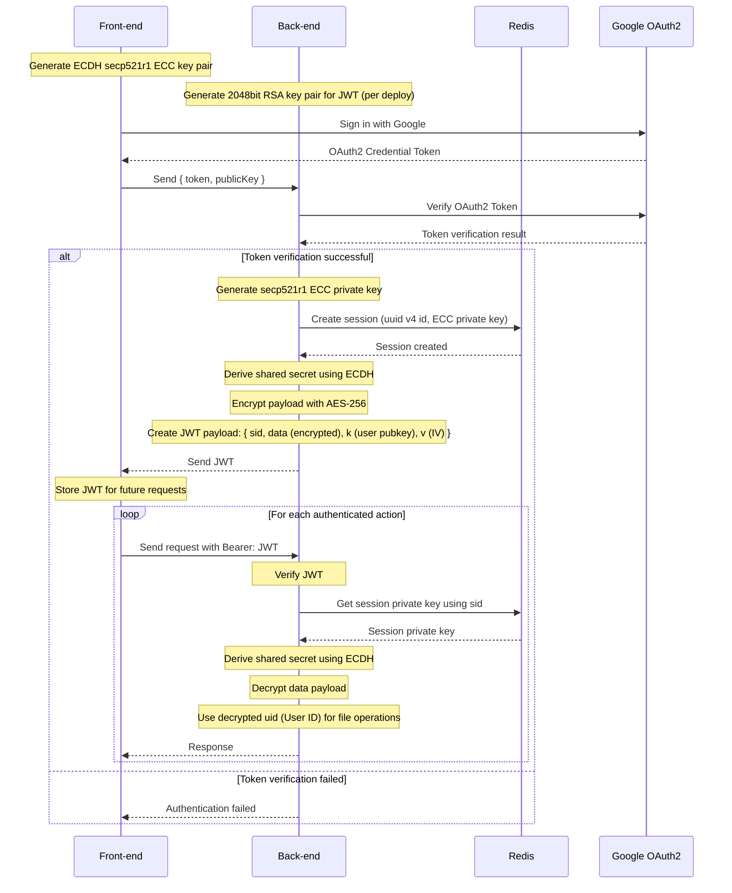

# NestJS + React File Storage

## Description

Back-End for File Storage that utilizes ECC, ECDH and AES-256 for session management (no storing PII)



## Installation

```bash
$ yarn install
```

## Running the app

Before starting the app
```bash
# precompile scripts, run before building app
$ yarn run prebuild
```

```bash
# development
$ yarn run start

# watch mode
$ yarn run start:dev

# production mode
$ yarn run start:prod
```

## Test

```bash
# unit tests
$ yarn run test

# e2e tests
$ yarn run test:e2e

# test coverage
$ yarn run test:cov
```

## Stay in touch

- Author - [dimankiev](https://github.com/dimankiev)

## License

This project is **UNLICENSED**.
